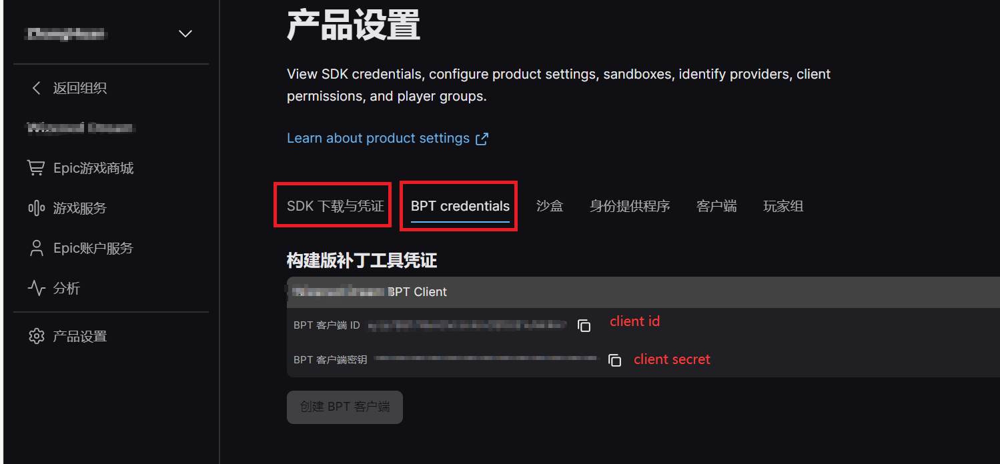

最新版本的Epic工具，已经自带了UI界面。
请使用Epic的工具。
此项目不再开发和维护。

# EpicGameUploader

Epic游戏上传工具BuildPatch Tool（BPT）只支持命令行，且上传忽略项仅支持以文件为单位。此工具以图形化界面配置上传参数，并支持忽略上传文件夹/文件。持久化保存配置参数。

一些参数可以从产品设置中拷贝，BPTClientId, BPTClientSecret(命令行参数 clientid clientsecret)为下图两个参数

